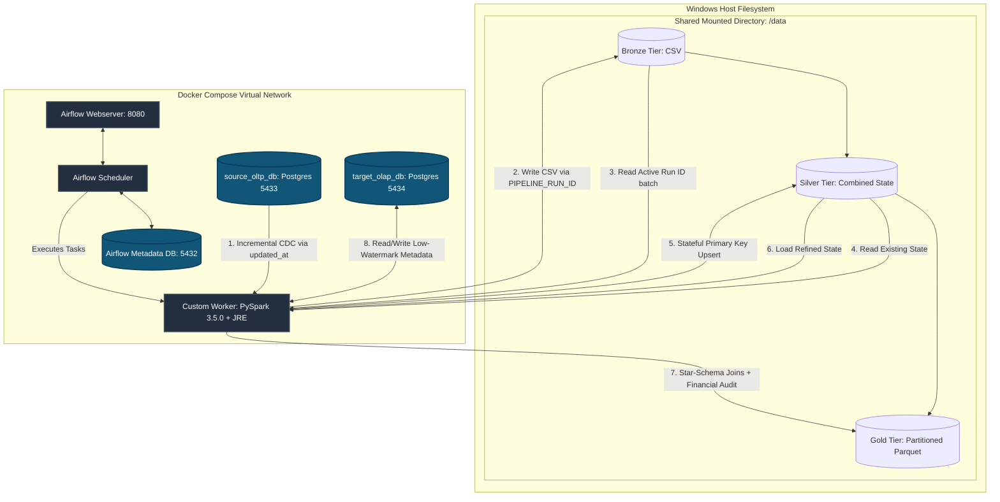

# 1. Project Overview

### 1.1 Introduction

The **`Ecommerce_data_pipeline`** is a production-grade, fully containerized data platform that implements a localized **Medallion Architecture** (Bronze $\rightarrow$ Silver $\rightarrow$ Gold). Orchestrated by **Apache Airflow**, the pipeline ingests transactional data from an operational source system, executes stateful data enrichment and incremental merging via **PySpark**, and exposes highly optimized analytical assets for downstream business intelligence consumption.

The entire framework is isolated within a dedicated virtual network using **Docker Compose**, eliminating local environmental dependencies and ensuring consistent, idempotent deployments across staging and production environments.

---

### 1.2 Project Objective

The primary engineering objective of this project is to shift from a legacy, destructive full-load framework to an efficient, low-overhead **Incremental Ingestion (Change Data Capture)** mechanism. The pipeline architecture is designed to:

* Automatically capture source mutations across e-commerce core tables (`source_customers`, `source_products`, and `source_orders`) utilizing high-watermark timestamp tracking.
* Isolate, audit, and deduplicate concurrent data batches without risking data loss or state contamination.
* Compute optimized analytical aggregations that power business dashboards while maximizing infrastructure resource utilization.

---

### 1.3 Business Context & Analytical Impact

Modern e-commerce platforms generate massive volumes of transactional logs daily. Traditional data systems frequently experience performance degradation because they run daily full-table overwrites, which heavily strain transactional databases and waste storage bandwidth.

By executing micro-batch incremental workloads, this project minimizes compute footprints on operational infrastructure. At the destination tier, it builds a star-schema analytical warehouse layer that surfaces vital corporate performance health metrics:

$$
\mathrm{Total\ Revenue} = \sum(\mathrm{total\_amount})
$$

$$
\mathrm{Total\ Orders} = \mathrm{Count}(\mathrm{order\_id})
$$

Downstream analytics users (such as BI Engineers and Product Managers) can evaluate these KPIs with near-zero query lag, eliminating the technical friction usually caused by parsing raw, un-indexed backend database records.

---

### 1.4 Expected Outcome & Target Stakeholders

The end state of the automated pipeline is a structured, optimized physical data lake layout.

* **Data Storage Assets:** Raw ingestion batches are cleanly isolated by execution tokens, transformed into structurally verified historical tables, and stored as highly compressed, Hive-partitioned Parquet files organized physically by `order_date=YYYY-MM-DD`.
* **Target Audience:** The direct beneficiaries include **Data Analysts** requiring low-latency access to pre-aggregated datasets, **Data Engineers** seeking a modular blueprint for stateful change capture, and **Business Leaders** tracking daily revenue and velocity fluctuations.

---

### 1.5 Core System Scope

The boundaries of the platform are explicitly defined to enforce architectural decoupling:

| Component | In-Scope Operational Boundary | Out-of-Scope System Boundary |
| --- | --- | --- |
| **Ingestion** | Micro-batch extraction from relational PostgreSQL OLTP engines using `updated_at` watermarks. | Real-time event streaming via tools like Apache Kafka or AWS Kinesis. |
| **Processing** | In-memory distributed data cleansing, schema validation, stateful deduplication, and aggregation via PySpark. | Complex, long-term machine learning model training or real-time predictive inferencing. |
| **Orchestration** | End-to-end task scheduling, pipeline run-id propagation, dependency enforcement, and failure retries through Airflow. | Advanced multi-tenant corporate security access routing or external identity management integration (OIDC/SAML). |
| **Serving Layer** | Local physical data lake files formatted with explicit partitioning structures ready for BI engine connectivity. | Direct generation, styling, or rendering of public-facing front-end data visualizations and reporting applications. |

---

Got it—let’s strip away the noise. In data engineering, portfolio projects are built to master and showcase best practices, but on a resume or documentation, it needs to be framed as solving one definitive architectural challenge.

Here is the rewritten, streamlined Problem Statement focusing on that single, core engineering challenge.

---

# 2. Problem Statement

### 2.1 The Core Challenge: Unscalable Data Ingestion and Analytical Processing

The primary problem this project addresses is the operational and technical inefficiency of handling enterprise data updates using a legacy full-load ($O(N)$) batch paradigm. In a typical unoptimized e-commerce data flow, every pipeline run forces a complete extraction of raw transactional tables (`source_customers`, `source_products`, `source_orders`) from production systems, followed by full-table overwrites at the destination.

As transaction volumes scale, this destructive and un-partitioned architecture causes four critical engineering failures:

* **Operational Risk:** Massive full-table queries strain the production transactional database (OLTP), consuming vital connection pools and risking application slowdowns or locking live customer checkout processes.
* **Destructive Data Loss:** Full overwrites delete historical record states, wiping out intermediate status transitions (e.g., an order moving from `PENDING` $\rightarrow$ `SHIPPED` $\rightarrow$ `DELIVERED`) and permanently damaging historical audit capabilities.
* **Wasted Compute Resource Cost:** Processing millions of static, unmodified records day after day results in redundant, expensive cluster workloads and high infrastructure overhead.
* **Analytical Query Latency:** Downstream visualization tools (like Power BI or Tableau) are forced to execute full-table scans over massive, un-indexed flat directories to return simple business metrics like `total_revenue` and `total_orders`, causing severe reporting delays.

### 2.2 The Solution Objective

To solve this bottleneck, this project builds a robust, end-to-end containerized Medallion data platform designed around production best practices: implementing low-overhead **Change Data Capture (CDC)** to protect source systems, enforcing **strict pipeline run isolation** via unique execution IDs, performing **stateful incremental upserts** to preserve history, and generating **Hive-style partitioned Parquet assets** to deliver sub-second analytical query performance.

---

# 3. Functional Requirements

### 3.1 Ingestion Capabilities (Change Data Capture)

The pipeline must capture state mutations from the source transactional database (`source_oltp_db`) incrementally, avoiding bulk transfers of unchanged historical records.

* **Source Systems:** The pipeline must ingest unstructured or structured records from three primary transactional tables: `source_customers`, `source_products`, and `source_orders`.
* **Watermark Extraction:** The system must evaluate the destination database’s target metadata table (`etl_metadata`) to retrieve the maximum timestamp (`updated_at`) from the prior successful run. It must extract only source records where `updated_at > last_watermark`.
* **Bronze Output Isolation:** To ensure traceability, every extraction batch must be stored in flat CSV file format and strictly isolated within a directory explicitly named after an Airflow-generated execution token: `data/bronze/<table_name>/run_<PIPELINE_RUN_ID>/`.

### 3.2 Target Analytical Warehousing & Output Matrix

The ultimate functional destination of the data is the Gold layer, optimized for high-performance analytical retrieval.

* **Serving Layer Format:** Data must be transformed from raw CSV files into highly optimized, compressed Parquet file structures.
* **Analytical Matrix Computations:** The Gold layer must pre-aggregate data to expose two vital business metrics:
* **`total_revenue`**: Calculated as the mathematical sum of the order transaction values.
* **`total_orders`**: Calculated as the distinct count of unique operational order IDs.


* **Downstream Delivery Structure:** The final output must be structurally organized into a physical star-schema model, exported into the local data directory (`data/gold/fact_orders`), and organized via Hive-style physical directory partitioning on the transaction date (`order_date=YYYY-MM-DD`).

### 3.3 Structural Governance & Business Rules

* **Run Isolation:** The Silver layer must only read the incremental Bronze folder that matches the active `PIPELINE_RUN_ID`. It must never perform blind scans of the entire Bronze directory.
* **Stateful Incremental Merge (Upsert):** The Silver layer cannot drop or fully overwrite target tables. Instead, it must read the existing historical Silver state, combine it with the newly ingested incremental Bronze run, and execute a state-retaining deduplication. It must resolve key conflicts by retaining the latest record based on the record's tracking timestamp (`updated_at`).
* **Defensive Dataset Skips:** If an extraction run yields zero new or modified source rows, the Bronze layer must skip creating a run directory. The Silver layer must detect this missing folder, log a warning message, skip that table's execution path gracefully, and return a clean success status code (`0`) instead of crashing the pipeline.
* **Data Reconciliation Auditing:** Before saving data assets into the Gold layer, the PySpark job must run a balancing audit matching input records against generated output metrics. The pipeline must verify that 100% of rows are completely accounted for across the layers.

---

# 4. Non-Functional Requirements

### 4.1 Modularity & Containerization

* **Zero Host Dependencies:** The entire ecosystem must operate seamlessly on standard hardware without requiring manual, local configurations of Apache Spark, Java Runtime Environments (JRE), Python packages, or individual database installations on the host operating system.
* **Microservice Isolation:** System components must be completely decoupled using independent Docker containers running inside an isolated Docker bridge network. The source transactional layer (`source_oltp_db`), target analytics warehouse (`target_olap_db`), and Airflow scheduler/compute workers must communicate exclusively over virtual network protocols.

### 4.2 Idempotency & Fault Tolerance

* **Deterministic Execution:** Re-executing a specific pipeline pipeline run multiple times—whether due to transient failures or manual re-runs—must yield identical final historical data states. It must never cause duplicate entries, data gaps, or corrupted historical states.
* **Automated Task Resilience:** Transient network failures or database connectivity timeouts must be handled gracefully by the orchestration engine. Airflow must enforce explicit retry counts and back-off delays before marking a task instance as failed.
* **Cross-Platform Path Portability:** The codebase must handle file path formatting dynamically across Windows host filesystems and Linux container mounts. The system must use automated Python environment context switching via `os.environ.get("AIRFLOW_HOME")` to construct paths dynamically based on the execution context.

### 4.3 Performance, Scalability & Maintainability

* **Optimized Data Retrieval (Partition Pruning):** Storage layouts must minimize query performance bottlenecks for downstream business intelligence tools like Power BI or Tableau. By enforcing Hive-style physical partitioning on `order_date`, the serving layer allows BI engines to prune irrelevant folders, eliminating slow, expensive full-table scans.
* **In-Memory Distributed Compute:** Heavy transformation operations, multi-table star-schema joins, and aggregation metrics calculations must be executed via an embedded **PySpark 3.5.0** runtime engine inside the Airflow environment. This leverages distributed in-memory data processing instead of resource-constrained single-thread processing.
* **Code Separation of Concerns:** To ensure long-term codebase maintainability, data engineering logic must be strictly decoupled from the scheduling orchestrator. Ingestion (`db_extractor.py`), cleansing/merging (`silver_processor.py`), and analytical transformation (`gold_transformer.py`) must live as independent, executable Python modules that can be run, tested, and debugged separately from Airflow DAG definitions.

---

# 5. Project Architecture

### 5.1 System Architecture Layout Diagram

The infrastructure layout demonstrates a completely decoupled, modular micro-services network pattern. All processing nodes, metadata warehouses, and operational transactional engines run inside isolated container runtime environments managed via a single orchestration blueprint.



---

### 5.2 Network Isolation Topography (Docker Compose Bridge)

The network architecture is configured to isolate structural data components from the host machine while exposing specific ports for maintenance and local developer inspection:

* **Network Isolation:** All containers bind to a single custom Docker virtual bridge network. Containers address one another securely using internal Docker DNS service discoverability aliases rather than hardcoded public IP vectors.
* **`source_oltp_db` Mapping:** Operates internally on port `5432` inside the network. It is forwarded externally to host port `5433` to allow safe, non-conflicting localized developer queries.
* **`target_olap_db` Mapping:** Operates internally on port `5432` to serve as the analytical control center. It maps externally to host port `5434`, safeguarding the structural tracking metrics schema (`etl_metadata`) from host network port collisions.
* **Airflow Application Node:** The orchestration dashboard exposes host container port `8080` to the loopback interface (`localhost:8080`), allowing administrators to manage execution runs securely.

---

### 5.3 Medallion Storage Layer Progression

The pipeline moves data through three distinct physical stages to ensure traceability and reliability:

* **Bronze Tier (Raw Ingestion):** Captures the transactional snapshot as a flat CSV text serialization asset. It enforces complete isolation by dropping batches exclusively into a subfolder named after the unique execution token: `data/bronze/<table_name>/run_<PIPELINE_RUN_ID>`.
* **Silver Tier (Refined Warehouse State):** Reads the run-specific Bronze folder, merges it with historical records, handles deduplication based on primary keys, and saves the cleaned, up-to-date state back to disk.
* **Gold Tier (Analytical Serving Assets):** Reads the consolidated Silver tables and executes relational joins to compute key business metrics (`total_revenue`, `total_orders`). It exports these metrics into a star-schema structure using compressed Hive-style directories (`order_date=YYYY-MM-DD`), which enables fast **partition pruning** for business intelligence tools like Power BI.

---

### 5.4 Orchestration Mapping & Component Interactions

Airflow acts as the centralized system coordinator. It does not process data directly; instead, it enforces dependencies, generates the unique `PIPELINE_RUN_ID` token, passes parameters across tasks, and invokes the processing layer.

The custom worker image loads a lightweight Java Runtime Environment (JRE) and the PySpark core libraries. This allows Airflow tasks to spawn independent, short-lived Spark contexts inside the worker container, isolating compute operations from storage nodes.

---

# 6. Technology Stack

### 6.1 Platform Architecture Component Analysis

| Technology | Architectural Role | Selected Rationale | Evaluated Alternatives |
| --- | --- | --- | --- |
| **Apache Airflow 2.x** | Central Orchestrator & State Scheduler | Programmatic DAG definitions, built-in task retry logic, and native execution run-ID propagation. | Linux CRON Scheduling, Prefect |
| **Apache PySpark 3.5.0** | Distributed Processing & Transformation Engine | High-performance in-memory distributed compute, native Hive partitioning support, and optimized Parquet file writing. | Vanilla Python Pandas, DuckDB |
| **PostgreSQL (OLTP)** | Operational Transactional Source Store | Simulates a production e-commerce backend with support for explicit primary keys and constraint-enforced relational engines. | MySQL, SQLite |
| **PostgreSQL (OLAP)** | Analytical Control Center & Audit Store | ACID-compliant state management for tracking low-watermarks and processing structural logging metadata. | Snowflake, AWS Redshift |
| **Docker Compose** | Infrastructure Virtualization & Network Layer | Ensures consistent, cross-platform container deployment, isolates microservices, and eliminates local environmental drift. | Bare-Metal Native OS Installation |

---

### 6.2 Detailed Architectural Rationale, Alternatives & Tradeoffs

#### Apache Airflow vs. Cron Scheduling

Using a standard Linux CRON framework introduces substantial operational risk. CRON processes run blindly on time-based triggers without an innate awareness of task states, resulting in silent failures and overlapping executions if a previous job runs long.

Apache Airflow provides an interactive framework that enforces strict upstream dependencies, meaning the Silver tier will never execute if the Bronze ingestion task encounters an outage. Additionally, Airflow captures and injects dynamic metadata tokens, allowing the system to use the same `PIPELINE_RUN_ID` across different execution containers.

#### Apache Spark vs. Vanilla Pandas DataFrame API

The Pandas DataFrame library processes data entirely within a single system thread and is constrained by the host machine's physical RAM limits. If a dataset size exceeds available memory, Pandas will crash with an Out-of-Memory (OOM) error.

```
[Pandas Processing Paradigm]  --> Single-Threaded Memory Bound (Risks OOM Failure)
[PySpark Processing Paradigm] --> Distributed In-Memory Processing + Lazy Evaluation Optimization

```

PySpark abstracts data transformations into logical, lazy-evaluation execution graphs. It optimizes query execution plans before processing data, and splits processing workloads across multiple CPU cores, allowing the pipeline to scale efficiently to millions of records.

#### PostgreSQL (Simulated Decoupled Topology)

Instead of relying on a single database for all operations, the architecture isolates the operational database from the analytical data warehouse. The transactional system (`source_oltp_db`) is dedicated entirely to handling simulated frontend transactions.

The metadata warehouse (`target_olap_db`) handles all data tracking workloads, ensuring that slow, complex metadata lookups and data updates never degrade checkout speeds or lock transaction rows on the live consumer storefront.

#### Docker Containers vs. Native Host Installations

Manually installing Apache Spark, specific Java Software Development Kits (JDK), system paths, and multiple database daemons on a local operating system creates brittle, environment-specific configurations.

Containerizing the solution using Docker Compose abstracts away the underlying operating system. This approach guarantees that directory mount parameters, Java-to-Spark version compatibility matrices, and cross-container network routing protocols behave identically regardless of whether the pipeline is executed on a local laptop or an enterprise cloud server.

---

# 7. Project Structure

### 7.1 File System Repository Layout Mapping

The directory layout below represents the physical organization of the workspace. It isolates operational infrastructure files, automated orchestration scripts, configuration layers, and a decoupled multi-tier data lake structure.

```text
Ecommerce_data_pipeline/
├── .env                             # Local environment variables and database credentials
├── .gitignore                       # Explicit files/directories excluded from version control
├── docker-compose.yml               # Service topology configuration (Airflow, Postgres nodes)
├── Dockerfile                       # Custom Airflow worker blueprint (Packages Java + PySpark 3.5.0)
├── requirements.txt                 # Absolute Python ecosystem library dependencies
├── test.py                          # Baseline structural integration testing script
├── tree.py                          # File system hierarchy verification utility
├── config/
│   └── pipeline_config.yaml         # Centralized configuration mapping database parameters & constraints
├── dags/                            # Airflow DAG definition scripts driving workflow tasks
├── Documentation/
│   └── Documentation.md             # Technical platform design ledger
├── data/                            # Decoupled Local Data Lake Storage Area
│   ├── bronze/                      # Raw Ingestion Tier (Grouped into run_PIPELINE_RUN_ID blocks)
│   │   ├── source_customers/
│   │   ├── source_orders/
│   │   └── source_products/
│   ├── silver/                      # Cleaned Warehouse State (Stateful PK merged historical tables)
│   │   ├── source_customers/
│   │   ├── source_orders/
│   │   └── source_products/
│   └── gold/                        # Star-Schema Models & KPI Metrics Aggregations
│       ├── aggregations/            # Target metrics storage (total_revenue, total_orders)
│       ├── dim_customers/           # Conformed customer dimension entity
│       ├── dim_products/            # Conformed product dimension entity
│       └── fact_orders/             # Fact transaction table (Hive-style physical partition logs)
├── logs/                            # Local runtime tracing output repository
└── scripts/                         # Core execution processing layer scripts
    ├── initialize_systems.py        # Single-execution setup routine (Builds control schemas)
    ├── simulate_incremental_load.py # Test generation rig (Injects mock transactions for CDC testing)
    ├── extraction/
    │   └── db_extractor.py          # Bronze layer micro-batch extraction routine
    └── transformation/
        ├── silver_processor.py      # Silver layer deduplication and upsert engine
        └── gold_transformer.py      # Gold layer relational star-modeling and metric engine

```

---

### 7.2 Component Responsibilities Directory Catalog

| Target Folder / File | Technical Operational Responsibility |
| --- | --- |
| **`docker-compose.yml`** | Configures and binds the independent containers (`source_oltp_db`, `target_olap_db`, and the Airflow node cluster) into an isolated virtual bridge network. |
| **`Dockerfile`** | Extends the base Airflow execution image by embedding a Java Runtime Environment (JRE) and configuring system environmental variables required to run standalone PySpark worker processes safely. |
| **`config/pipeline_config.yaml`** | Stores externalized parameters—such as table primary keys, column naming schema arrays, and watermark bounds—preventing development strings from being hardcoded into core execution scripts. |
| **`scripts/initialize_systems.py`** | Runs once to establish baseline tracking infrastructures, build the low-watermark metadata tables (`etl_metadata`), and prevent production ingestion tasks from executing blindly against non-existent schemas. |
| **`scripts/simulate_incremental_load.py`** | Serves as the localized testing harness. It appends fresh, randomized mock transaction rows directly to the operational OLTP engine to easily demonstrate and stress-test the CDC ingestion framework. |
| **`scripts/extraction/`** | Houses the ingestion worker script. It pulls low-watermarks, evaluates delta transformations at the source, and writes immutable records out to the data lake directory. |
| **`scripts/transformation/`** | Contains the core processing engines. The Silver processing routine performs primary-key based historical upserts, and the Gold transformer calculates core corporate KPI aggregates using PySpark's data frames. |

---

# 8. Data Flow

The operational data lifecycle spans four clear processing boundaries, converting raw transaction mutations into optimized analytical assets.

### Step 1: Micro-Batch CDC Source Ingestion

Every pipeline execution cycle starts when the Airflow orchestrator generates a unique workflow execution token, known as the `PIPELINE_RUN_ID`.

* The `db_extractor.py` execution task hits the target analytical control warehouse (`target_olap_db`) and queries the tracking system table: `SELECT last_processed_timestamp FROM etl_metadata WHERE table_name = :t`.
* Using this extracted timestamp as a strict boundary value (the low watermark), the script constructs a filtered query to read from the operational engine (`source_oltp_db`): `SELECT * FROM source_table WHERE updated_at > :low_watermark`.
* The extracted delta rows are written out as raw CSV records to the filesystem. To prevent multi-thread race conditions or accidental write collisions, they are saved exclusively inside an isolated execution directory: `data/bronze/<table_name>/run_<PIPELINE_RUN_ID>/`.

### Step 2: Silver Layer Consolidation & Incremental Upsert

Once the raw extraction task completes, control is handed over to the transformation tier via `silver_processor.py`.

* The processor reads *only* the specific directory generated by the current execution token. If no modifications occurred at the source database, the directory will be absent; the processor catches this gracefully, skips further actions, logs an informational block, and completes with a successful return status code (`0`).
* If data is present, the script loads the incremental batch and checks for an existing historical file structure within `data/silver/<table_name>/`.
* If a historical state exists, PySpark merges the past rows with the current ingestion file. The script runs an analytical deduplication check across the entire dataset, tracking identical primary keys and keeping only the record containing the latest timestamp value:

$$\text{Target State} = \text{Filter}\left(\text{Row Number} = 1 \text{ SORT BY } \text{updated\_at DESC}\right)$$

* The deduplicated, clean warehouse state is written directly back to the Silver directory, continuously building out the historical archive without destroying existing states.

### Step 3: Gold Layer Star-Schema Synthesis & Balancing Audits

The finalized Silver tables represent a fully verified operational data warehouse state. The pipeline then triggers `gold_transformer.py` to construct analytical assets.

* PySpark boots an active session container and loads the cleaned historical tables (`source_customers`, `source_products`, and `source_orders`).
* The system performs relational joins across primary and foreign keys, mapping entities into highly structured dimension tables (`dim_customers`, `dim_products`) and atomic business transaction tracking tables (`fact_orders`).
* **Financial Data Reconciliation Auditing:** To prevent reporting anomalies, the script counts the total rows entering the job against the records about to be exported. If the inputs and outputs fail to align perfectly, the validation suite kills the execution run, flags a processing alert, and stops bad data from corrupting public dashboards.

### Step 4: Storage Optimization & Business Consumption

The verified, audit-clean analytical models are written to disk using high-performance storage optimization strategies.

* Dataframes are exported into the local data directory (`data/gold/fact_orders`) and formatted as heavily compressed **Parquet column-oriented files**.
* The directory structure enforces physical layout partitioning using a Hive-style convention based on transaction dates: `order_date=YYYY-MM-DD/`.
* Downstream reporting engines (like Power BI or Tableau) can query the data using **partition pruning**. This design allows dashboards to target and scan only the specific date directories required by a report, completely eliminating expensive full-table scans and delivering sub-second reporting visualizations.

---

