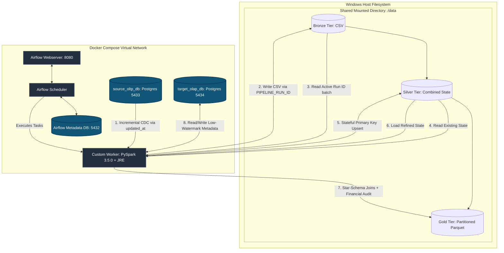

# 1. Project Overview

### 1.1 Introduction

The **`Ecommerce_data_pipeline`** is a production-grade, fully containerized data platform that implements a localized **Medallion Architecture** (Bronze $\rightarrow$ Silver $\rightarrow$ Gold). Orchestrated by **Apache Airflow**, the pipeline ingests transactional data from an operational source system, executes stateful data enrichment and incremental merging via **PySpark**, and exposes highly optimized analytical assets for downstream business intelligence consumption.

The entire framework is isolated within a dedicated virtual network using **Docker Compose**, eliminating local environmental dependencies and ensuring consistent, idempotent deployments across staging and production environments.

---

### 1.2 Project Objective

The primary engineering objective of this project is to shift from a legacy, destructive full-load framework to an efficient, low-overhead **Incremental Ingestion (Change Data Capture)** mechanism. The pipeline architecture is designed to:

* Automatically capture source mutations across e-commerce core tables (`source_customers`, `source_products`, and `source_orders`) utilizing high-watermark timestamp tracking.
* Isolate, audit, and deduplicate concurrent data batches without risking data loss or state contamination.
* Compute optimized analytical aggregations that power business dashboards while maximizing infrastructure resource utilization.

---

### 1.3 Business Context & Analytical Impact

Modern e-commerce platforms generate massive volumes of transactional logs daily. Traditional data systems frequently experience performance degradation because they run daily full-table overwrites, which heavily strain transactional databases and waste storage bandwidth.

By executing micro-batch incremental workloads, this project minimizes compute footprints on operational infrastructure. At the destination tier, it builds a star-schema analytical warehouse layer that surfaces vital corporate performance health metrics:

$$
\mathrm{Total\ Revenue} = \sum(\mathrm{total\_amount})
$$

$$
\mathrm{Total\ Orders} = \mathrm{Count}(\mathrm{order\_id})
$$

Downstream analytics users (such as BI Engineers and Product Managers) can evaluate these KPIs with near-zero query lag, eliminating the technical friction usually caused by parsing raw, un-indexed backend database records.

---

### 1.4 Expected Outcome & Target Stakeholders

The end state of the automated pipeline is a structured, optimized physical data lake layout.

* **Data Storage Assets:** Raw ingestion batches are cleanly isolated by execution tokens, transformed into structurally verified historical tables, and stored as highly compressed, Hive-partitioned Parquet files organized physically by `order_date=YYYY-MM-DD`.
* **Target Audience:** The direct beneficiaries include **Data Analysts** requiring low-latency access to pre-aggregated datasets, **Data Engineers** seeking a modular blueprint for stateful change capture, and **Business Leaders** tracking daily revenue and velocity fluctuations.

---

### 1.5 Core System Scope

The boundaries of the platform are explicitly defined to enforce architectural decoupling:

| Component | In-Scope Operational Boundary | Out-of-Scope System Boundary |
| --- | --- | --- |
| **Ingestion** | Micro-batch extraction from relational PostgreSQL OLTP engines using `updated_at` watermarks. | Real-time event streaming via tools like Apache Kafka or AWS Kinesis. |
| **Processing** | In-memory distributed data cleansing, schema validation, stateful deduplication, and aggregation via PySpark. | Complex, long-term machine learning model training or real-time predictive inferencing. |
| **Orchestration** | End-to-end task scheduling, pipeline run-id propagation, dependency enforcement, and failure retries through Airflow. | Advanced multi-tenant corporate security access routing or external identity management integration (OIDC/SAML). |
| **Serving Layer** | Local physical data lake files formatted with explicit partitioning structures ready for BI engine connectivity. | Direct generation, styling, or rendering of public-facing front-end data visualizations and reporting applications. |

---

Got it—let’s strip away the noise. In data engineering, portfolio projects are built to master and showcase best practices, but on a resume or documentation, it needs to be framed as solving one definitive architectural challenge.

Here is the rewritten, streamlined Problem Statement focusing on that single, core engineering challenge.

---

# 2. Problem Statement

### 2.1 The Core Challenge: Unscalable Data Ingestion and Analytical Processing

The primary problem this project addresses is the operational and technical inefficiency of handling enterprise data updates using a legacy full-load ($O(N)$) batch paradigm. In a typical unoptimized e-commerce data flow, every pipeline run forces a complete extraction of raw transactional tables (`source_customers`, `source_products`, `source_orders`) from production systems, followed by full-table overwrites at the destination.

As transaction volumes scale, this destructive and un-partitioned architecture causes four critical engineering failures:

* **Operational Risk:** Massive full-table queries strain the production transactional database (OLTP), consuming vital connection pools and risking application slowdowns or locking live customer checkout processes.
* **Destructive Data Loss:** Full overwrites delete historical record states, wiping out intermediate status transitions (e.g., an order moving from `PENDING` $\rightarrow$ `SHIPPED` $\rightarrow$ `DELIVERED`) and permanently damaging historical audit capabilities.
* **Wasted Compute Resource Cost:** Processing millions of static, unmodified records day after day results in redundant, expensive cluster workloads and high infrastructure overhead.
* **Analytical Query Latency:** Downstream visualization tools (like Power BI or Tableau) are forced to execute full-table scans over massive, un-indexed flat directories to return simple business metrics like `total_revenue` and `total_orders`, causing severe reporting delays.

### 2.2 The Solution Objective

To solve this bottleneck, this project builds a robust, end-to-end containerized Medallion data platform designed around production best practices: implementing low-overhead **Change Data Capture (CDC)** to protect source systems, enforcing **strict pipeline run isolation** via unique execution IDs, performing **stateful incremental upserts** to preserve history, and generating **Hive-style partitioned Parquet assets** to deliver sub-second analytical query performance.

---

# 3. Functional Requirements

### 3.1 Ingestion Capabilities (Change Data Capture)

The pipeline must capture state mutations from the source transactional database (`source_oltp_db`) incrementally, avoiding bulk transfers of unchanged historical records.

* **Source Systems:** The pipeline must ingest unstructured or structured records from three primary transactional tables: `source_customers`, `source_products`, and `source_orders`.
* **Watermark Extraction:** The system must evaluate the destination database’s target metadata table (`etl_metadata`) to retrieve the maximum timestamp (`updated_at`) from the prior successful run. It must extract only source records where `updated_at > last_watermark`.
* **Bronze Output Isolation:** To ensure traceability, every extraction batch must be stored in flat CSV file format and strictly isolated within a directory explicitly named after an Airflow-generated execution token: `data/bronze/<table_name>/run_<PIPELINE_RUN_ID>/`.

### 3.2 Target Analytical Warehousing & Output Matrix

The ultimate functional destination of the data is the Gold layer, optimized for high-performance analytical retrieval.

* **Serving Layer Format:** Data must be transformed from raw CSV files into highly optimized, compressed Parquet file structures.
* **Analytical Matrix Computations:** The Gold layer must pre-aggregate data to expose two vital business metrics:
* **`total_revenue`**: Calculated as the mathematical sum of the order transaction values.
* **`total_orders`**: Calculated as the distinct count of unique operational order IDs.


* **Downstream Delivery Structure:** The final output must be structurally organized into a physical star-schema model, exported into the local data directory (`data/gold/fact_orders`), and organized via Hive-style physical directory partitioning on the transaction date (`order_date=YYYY-MM-DD`).

### 3.3 Structural Governance & Business Rules

* **Run Isolation:** The Silver layer must only read the incremental Bronze folder that matches the active `PIPELINE_RUN_ID`. It must never perform blind scans of the entire Bronze directory.
* **Stateful Incremental Merge (Upsert):** The Silver layer cannot drop or fully overwrite target tables. Instead, it must read the existing historical Silver state, combine it with the newly ingested incremental Bronze run, and execute a state-retaining deduplication. It must resolve key conflicts by retaining the latest record based on the record's tracking timestamp (`updated_at`).
* **Defensive Dataset Skips:** If an extraction run yields zero new or modified source rows, the Bronze layer must skip creating a run directory. The Silver layer must detect this missing folder, log a warning message, skip that table's execution path gracefully, and return a clean success status code (`0`) instead of crashing the pipeline.
* **Data Reconciliation Auditing:** Before saving data assets into the Gold layer, the PySpark job must run a balancing audit matching input records against generated output metrics. The pipeline must verify that 100% of rows are completely accounted for across the layers.

---

# 4. Non-Functional Requirements

### 4.1 Modularity & Containerization

* **Zero Host Dependencies:** The entire ecosystem must operate seamlessly on standard hardware without requiring manual, local configurations of Apache Spark, Java Runtime Environments (JRE), Python packages, or individual database installations on the host operating system.
* **Microservice Isolation:** System components must be completely decoupled using independent Docker containers running inside an isolated Docker bridge network. The source transactional layer (`source_oltp_db`), target analytics warehouse (`target_olap_db`), and Airflow scheduler/compute workers must communicate exclusively over virtual network protocols.

### 4.2 Idempotency & Fault Tolerance

* **Deterministic Execution:** Re-executing a specific pipeline pipeline run multiple times—whether due to transient failures or manual re-runs—must yield identical final historical data states. It must never cause duplicate entries, data gaps, or corrupted historical states.
* **Automated Task Resilience:** Transient network failures or database connectivity timeouts must be handled gracefully by the orchestration engine. Airflow must enforce explicit retry counts and back-off delays before marking a task instance as failed.
* **Cross-Platform Path Portability:** The codebase must handle file path formatting dynamically across Windows host filesystems and Linux container mounts. The system must use automated Python environment context switching via `os.environ.get("AIRFLOW_HOME")` to construct paths dynamically based on the execution context.

### 4.3 Performance, Scalability & Maintainability

* **Optimized Data Retrieval (Partition Pruning):** Storage layouts must minimize query performance bottlenecks for downstream business intelligence tools like Power BI or Tableau. By enforcing Hive-style physical partitioning on `order_date`, the serving layer allows BI engines to prune irrelevant folders, eliminating slow, expensive full-table scans.
* **In-Memory Distributed Compute:** Heavy transformation operations, multi-table star-schema joins, and aggregation metrics calculations must be executed via an embedded **PySpark 3.5.0** runtime engine inside the Airflow environment. This leverages distributed in-memory data processing instead of resource-constrained single-thread processing.
* **Code Separation of Concerns:** To ensure long-term codebase maintainability, data engineering logic must be strictly decoupled from the scheduling orchestrator. Ingestion (`db_extractor.py`), cleansing/merging (`silver_processor.py`), and analytical transformation (`gold_transformer.py`) must live as independent, executable Python modules that can be run, tested, and debugged separately from Airflow DAG definitions.

---

# 5. Project Architecture

### 5.1 System Architecture Layout Diagram

The infrastructure layout demonstrates a completely decoupled, modular micro-services network pattern. All processing nodes, metadata warehouses, and operational transactional engines run inside isolated container runtime environments managed via a single orchestration blueprint.



---

### 5.2 Network Isolation Topography (Docker Compose Bridge)

The network architecture is configured to isolate structural data components from the host machine while exposing specific ports for maintenance and local developer inspection:

* **Network Isolation:** All containers bind to a single custom Docker virtual bridge network. Containers address one another securely using internal Docker DNS service discoverability aliases rather than hardcoded public IP vectors.
* **`source_oltp_db` Mapping:** Operates internally on port `5432` inside the network. It is forwarded externally to host port `5433` to allow safe, non-conflicting localized developer queries.
* **`target_olap_db` Mapping:** Operates internally on port `5432` to serve as the analytical control center. It maps externally to host port `5434`, safeguarding the structural tracking metrics schema (`etl_metadata`) from host network port collisions.
* **Airflow Application Node:** The orchestration dashboard exposes host container port `8080` to the loopback interface (`localhost:8080`), allowing administrators to manage execution runs securely.

---

### 5.3 Medallion Storage Layer Progression

The pipeline moves data through three distinct physical stages to ensure traceability and reliability:

* **Bronze Tier (Raw Ingestion):** Captures the transactional snapshot as a flat CSV text serialization asset. It enforces complete isolation by dropping batches exclusively into a subfolder named after the unique execution token: `data/bronze/<table_name>/run_<PIPELINE_RUN_ID>`.
* **Silver Tier (Refined Warehouse State):** Reads the run-specific Bronze folder, merges it with historical records, handles deduplication based on primary keys, and saves the cleaned, up-to-date state back to disk.
* **Gold Tier (Analytical Serving Assets):** Reads the consolidated Silver tables and executes relational joins to compute key business metrics (`total_revenue`, `total_orders`). It exports these metrics into a star-schema structure using compressed Hive-style directories (`order_date=YYYY-MM-DD`), which enables fast **partition pruning** for business intelligence tools like Power BI.

---

### 5.4 Orchestration Mapping & Component Interactions

Airflow acts as the centralized system coordinator. It does not process data directly; instead, it enforces dependencies, generates the unique `PIPELINE_RUN_ID` token, passes parameters across tasks, and invokes the processing layer.

The custom worker image loads a lightweight Java Runtime Environment (JRE) and the PySpark core libraries. This allows Airflow tasks to spawn independent, short-lived Spark contexts inside the worker container, isolating compute operations from storage nodes.

---

# 6. Technology Stack

### 6.1 Platform Architecture Component Analysis

| Technology | Architectural Role | Selected Rationale | Evaluated Alternatives |
| --- | --- | --- | --- |
| **Apache Airflow 2.x** | Central Orchestrator & State Scheduler | Programmatic DAG definitions, built-in task retry logic, and native execution run-ID propagation. | Linux CRON Scheduling, Prefect |
| **Apache PySpark 3.5.0** | Distributed Processing & Transformation Engine | High-performance in-memory distributed compute, native Hive partitioning support, and optimized Parquet file writing. | Vanilla Python Pandas, DuckDB |
| **PostgreSQL (OLTP)** | Operational Transactional Source Store | Simulates a production e-commerce backend with support for explicit primary keys and constraint-enforced relational engines. | MySQL, SQLite |
| **PostgreSQL (OLAP)** | Analytical Control Center & Audit Store | ACID-compliant state management for tracking low-watermarks and processing structural logging metadata. | Snowflake, AWS Redshift |
| **Docker Compose** | Infrastructure Virtualization & Network Layer | Ensures consistent, cross-platform container deployment, isolates microservices, and eliminates local environmental drift. | Bare-Metal Native OS Installation |

---

### 6.2 Detailed Architectural Rationale, Alternatives & Tradeoffs

#### Apache Airflow vs. Cron Scheduling

Using a standard Linux CRON framework introduces substantial operational risk. CRON processes run blindly on time-based triggers without an innate awareness of task states, resulting in silent failures and overlapping executions if a previous job runs long.

Apache Airflow provides an interactive framework that enforces strict upstream dependencies, meaning the Silver tier will never execute if the Bronze ingestion task encounters an outage. Additionally, Airflow captures and injects dynamic metadata tokens, allowing the system to use the same `PIPELINE_RUN_ID` across different execution containers.

#### Apache Spark vs. Vanilla Pandas DataFrame API

The Pandas DataFrame library processes data entirely within a single system thread and is constrained by the host machine's physical RAM limits. If a dataset size exceeds available memory, Pandas will crash with an Out-of-Memory (OOM) error.

```
[Pandas Processing Paradigm]  --> Single-Threaded Memory Bound (Risks OOM Failure)
[PySpark Processing Paradigm] --> Distributed In-Memory Processing + Lazy Evaluation Optimization

```

PySpark abstracts data transformations into logical, lazy-evaluation execution graphs. It optimizes query execution plans before processing data, and splits processing workloads across multiple CPU cores, allowing the pipeline to scale efficiently to millions of records.

#### PostgreSQL (Simulated Decoupled Topology)

Instead of relying on a single database for all operations, the architecture isolates the operational database from the analytical data warehouse. The transactional system (`source_oltp_db`) is dedicated entirely to handling simulated frontend transactions.

The metadata warehouse (`target_olap_db`) handles all data tracking workloads, ensuring that slow, complex metadata lookups and data updates never degrade checkout speeds or lock transaction rows on the live consumer storefront.

#### Docker Containers vs. Native Host Installations

Manually installing Apache Spark, specific Java Software Development Kits (JDK), system paths, and multiple database daemons on a local operating system creates brittle, environment-specific configurations.

Containerizing the solution using Docker Compose abstracts away the underlying operating system. This approach guarantees that directory mount parameters, Java-to-Spark version compatibility matrices, and cross-container network routing protocols behave identically regardless of whether the pipeline is executed on a local laptop or an enterprise cloud server.

---

# 7. Project Structure

### 7.1 File System Repository Layout Mapping

The directory layout below represents the physical organization of the workspace. It isolates operational infrastructure files, automated orchestration scripts, configuration layers, and a decoupled multi-tier data lake structure.

```text
Ecommerce_data_pipeline/
├── .env                             # Local environment variables and database credentials
├── .gitignore                       # Explicit files/directories excluded from version control
├── docker-compose.yml               # Service topology configuration (Airflow, Postgres nodes)
├── Dockerfile                       # Custom Airflow worker blueprint (Packages Java + PySpark 3.5.0)
├── requirements.txt                 # Absolute Python ecosystem library dependencies
├── test.py                          # Baseline structural integration testing script
├── tree.py                          # File system hierarchy verification utility
├── config/
│   └── pipeline_config.yaml         # Centralized configuration mapping database parameters & constraints
├── dags/                            # Airflow DAG definition scripts driving workflow tasks
├── Documentation/
│   └── Documentation.md             # Technical platform design ledger
├── data/                            # Decoupled Local Data Lake Storage Area
│   ├── bronze/                      # Raw Ingestion Tier (Grouped into run_PIPELINE_RUN_ID blocks)
│   │   ├── source_customers/
│   │   ├── source_orders/
│   │   └── source_products/
│   ├── silver/                      # Cleaned Warehouse State (Stateful PK merged historical tables)
│   │   ├── source_customers/
│   │   ├── source_orders/
│   │   └── source_products/
│   └── gold/                        # Star-Schema Models & KPI Metrics Aggregations
│       ├── aggregations/            # Target metrics storage (total_revenue, total_orders)
│       ├── dim_customers/           # Conformed customer dimension entity
│       ├── dim_products/            # Conformed product dimension entity
│       └── fact_orders/             # Fact transaction table (Hive-style physical partition logs)
├── logs/                            # Local runtime tracing output repository
└── scripts/                         # Core execution processing layer scripts
    ├── initialize_systems.py        # Single-execution setup routine (Builds control schemas)
    ├── simulate_incremental_load.py # Test generation rig (Injects mock transactions for CDC testing)
    ├── extraction/
    │   └── db_extractor.py          # Bronze layer micro-batch extraction routine
    └── transformation/
        ├── silver_processor.py      # Silver layer deduplication and upsert engine
        └── gold_transformer.py      # Gold layer relational star-modeling and metric engine

```

---

### 7.2 Component Responsibilities Directory Catalog

| Target Folder / File | Technical Operational Responsibility |
| --- | --- |
| **`docker-compose.yml`** | Configures and binds the independent containers (`source_oltp_db`, `target_olap_db`, and the Airflow node cluster) into an isolated virtual bridge network. |
| **`Dockerfile`** | Extends the base Airflow execution image by embedding a Java Runtime Environment (JRE) and configuring system environmental variables required to run standalone PySpark worker processes safely. |
| **`config/pipeline_config.yaml`** | Stores externalized parameters—such as table primary keys, column naming schema arrays, and watermark bounds—preventing development strings from being hardcoded into core execution scripts. |
| **`scripts/initialize_systems.py`** | Runs once to establish baseline tracking infrastructures, build the low-watermark metadata tables (`etl_metadata`), and prevent production ingestion tasks from executing blindly against non-existent schemas. |
| **`scripts/simulate_incremental_load.py`** | Serves as the localized testing harness. It appends fresh, randomized mock transaction rows directly to the operational OLTP engine to easily demonstrate and stress-test the CDC ingestion framework. |
| **`scripts/extraction/`** | Houses the ingestion worker script. It pulls low-watermarks, evaluates delta transformations at the source, and writes immutable records out to the data lake directory. |
| **`scripts/transformation/`** | Contains the core processing engines. The Silver processing routine performs primary-key based historical upserts, and the Gold transformer calculates core corporate KPI aggregates using PySpark's data frames. |

---

# 8. Data Flow

The operational data lifecycle spans four clear processing boundaries, converting raw transaction mutations into optimized analytical assets.

### Step 1: Micro-Batch CDC Source Ingestion

Every pipeline execution cycle starts when the Airflow orchestrator generates a unique workflow execution token, known as the `PIPELINE_RUN_ID`.

* The `db_extractor.py` execution task hits the target analytical control warehouse (`target_olap_db`) and queries the tracking system table: `SELECT last_processed_timestamp FROM etl_metadata WHERE table_name = :t`.
* Using this extracted timestamp as a strict boundary value (the low watermark), the script constructs a filtered query to read from the operational engine (`source_oltp_db`): `SELECT * FROM source_table WHERE updated_at > :low_watermark`.
* The extracted delta rows are written out as raw CSV records to the filesystem. To prevent multi-thread race conditions or accidental write collisions, they are saved exclusively inside an isolated execution directory: `data/bronze/<table_name>/run_<PIPELINE_RUN_ID>/`.

### Step 2: Silver Layer Consolidation & Incremental Upsert

Once the raw extraction task completes, control is handed over to the transformation tier via `silver_processor.py`.

* The processor reads *only* the specific directory generated by the current execution token. If no modifications occurred at the source database, the directory will be absent; the processor catches this gracefully, skips further actions, logs an informational block, and completes with a successful return status code (`0`).
* If data is present, the script loads the incremental batch and checks for an existing historical file structure within `data/silver/<table_name>/`.
* If a historical state exists, PySpark merges the past rows with the current ingestion file. The script runs an analytical deduplication check across the entire dataset, tracking identical primary keys and keeping only the record containing the latest timestamp value:

$$\text{Target State} = \text{Filter}\left(\text{Row Number} = 1 \text{ SORT BY } \text{updated\_at DESC}\right)$$

* The deduplicated, clean warehouse state is written directly back to the Silver directory, continuously building out the historical archive without destroying existing states.

### Step 3: Gold Layer Star-Schema Synthesis & Balancing Audits

The finalized Silver tables represent a fully verified operational data warehouse state. The pipeline then triggers `gold_transformer.py` to construct analytical assets.

* PySpark boots an active session container and loads the cleaned historical tables (`source_customers`, `source_products`, and `source_orders`).
* The system performs relational joins across primary and foreign keys, mapping entities into highly structured dimension tables (`dim_customers`, `dim_products`) and atomic business transaction tracking tables (`fact_orders`).
* **Financial Data Reconciliation Auditing:** To prevent reporting anomalies, the script counts the total rows entering the job against the records about to be exported. If the inputs and outputs fail to align perfectly, the validation suite kills the execution run, flags a processing alert, and stops bad data from corrupting public dashboards.

### Step 4: Storage Optimization & Business Consumption

The verified, audit-clean analytical models are written to disk using high-performance storage optimization strategies.

* Dataframes are exported into the local data directory (`data/gold/fact_orders`) and formatted as heavily compressed **Parquet column-oriented files**.
* The directory structure enforces physical layout partitioning using a Hive-style convention based on transaction dates: `order_date=YYYY-MM-DD/`.
* Downstream reporting engines (like Power BI or Tableau) can query the data using **partition pruning**. This design allows dashboards to target and scan only the specific date directories required by a report, completely eliminating expensive full-table scans and delivering sub-second reporting visualizations.

---

# 9. Pipeline Design

### 9.1 Bronze Tier Ingestion (CDC Mechanics & Low-Watermarks)

The Bronze layer is managed by the execution script `db_extractor.py`. Its sole responsibility is to extract delta rows from the transactional source system with minimal overhead.

```
[target_olap_db.etl_metadata] ──> Fetch Last High-Watermark Timestamp
                                                │
                                                ▼
[source_oltp_db.source_tables] ─> Run Parameterized Query: WHERE updated_at > Low-Watermark
                                                │
                                                ▼
[Local Data Lake File System] ──> Write Immutable Raw CSV to run_<PIPELINE_RUN_ID>/

```

* **Watermark Retrieval:** At runtime, the script connects to the analytical audit database (`target_olap_db`) and reads the control table `etl_metadata`. It executes a lookup for each target table (`source_customers`, `source_products`, and `source_orders`) to discover the maximum timestamp processed during the last successful run. If no tracking record is found, the system defaults to a historical epoch timestamp (`1970-01-01 00:00:00`).
* **Delta Extraction Execution:** Using the retrieved timestamp as a parameter bound (the low-watermark), the extractor initializes a connection pool against the operational transactional engine (`source_oltp_db`). It executes an optimized, non-locking select statement:
```sql
SELECT id, ... , created_at, updated_at 
FROM source_table 
WHERE updated_at > :low_watermark;

```


* **Immutable Storage Formatting:** Rows returned by the query are serialized directly into flat CSV files. The script stores these files inside an isolated, execution-locked path structural convention: `data/bronze/<table_name>/run_<PIPELINE_RUN_ID>/`. This guarantees that every ingestion batch remains immutable and independent of concurrent orchestration tasks.

---

### 9.2 Silver Tier Refining (Deduplication & Primary Key State Merges)

The Silver layer is driven by `silver_processor.py` using PySpark. It transforms fragmented raw change batches into clean, historically accurate historical tables.

* **Defensive Existence Verification:** Before allocating distributed compute resources, the script checks if the specific `run_<PIPELINE_RUN_ID>` directory exists inside the Bronze folder. If the directory is missing (meaning the source database had zero updates during that time window), the script halts processing for that table, writes an informational log entry, and exits cleanly with a success status code (`0`) instead of throwing an error.
* **State Reconstruction & Appending:** When data is present, PySpark reads both the new incremental CSV batch and the existing historical table saved at `data/silver/<table_name>/` (if an existing state is available). It combines these datasets into a single in-memory distributed DataFrame.
* **State Resolution Window Logic:** To resolve row mutations and remove duplicate entries, the script applies an analytical window function across the combined dataset. It groups the records by their unique primary key and sorts them in descending order by the record's modification tracking timestamp:

$$W = \text{Window.partitionBy}(\text{"primary\_key"}).\text{orderBy}(\text{col}(\text{"updated\_at"}).\text{desc}())$$

* **Deduplication and Upsert Execution:** The algorithm computes a structural rank variable over the defined window:

$$\text{resolved\_df} = \text{historical\_df}.\text{withColumn}(\text{"row\_num"}, \text{row\_number}().\text{over}(W)).\text{filter}(\text{col}(\text{"row\_num"}) == 1)$$

* This process drops older record states and preserves only the newest modification state for each primary key. The resolved DataFrame is then written back to the Silver directory (`data/silver/<table_name>/`), maintaining a clean, deduplicated operational historical layer.

---

### 9.3 Gold Tier Synthesis (Star-Schema Engineering & Business Metrics Compiling)

The final stage is managed by `gold_transformer.py`. This script transforms the processed warehouse tables into structured star-schema models optimized for fast business intelligence reporting.

* **Star-Schema Dimensional Modeling:** PySpark loads the refined Silver tables (`source_customers`, `source_products`, and `source_orders`). It extracts, reorganizes, and conforms attributes to build independent dimensional entities (`dim_customers`, `dim_products`) and a centralized business transaction tracking table (`fact_orders`).
* **KPI Metrics Aggregation Compilation:** Within the `data/gold/aggregations/` directory, the engine builds pre-computed summaries to calculate the core performance indicators defined by management:
* **`total_revenue`**: The mathematical sum of all order totals.
* **`total_orders`**: The total count of distinct order IDs.


* **Data Quality Reconciliation Balancing Audits:** Before writing records to disk, the script executes an inline data quality balancing check. It compares the sum of rows entering the transformation step against the total records inside the output targets. If any rows are missing, the validation script aborts the execution run, throws an error, and prevents corrupted data from hitting downstream layers.
* **Physical Target Export Optimization:** Verified data models are exported into the data lake as highly compressed Parquet files. The factory transaction table enforces physical directory partitioning using a Hive-style layout strategy based on the transaction date: `data/gold/fact_orders/order_date=YYYY-MM-DD/`. This optimization allows business dashboards to prune irrelevant folders during queries, delivering sub-second visualization performance.

---

# 10. Design Decisions

### 10.1 Decision 1: Shifting Initialization Out of the DAG Lifecycle

* **Decision Made:** Separated database schema creation and seed data population out of the recurring Airflow Directed Acyclic Graph (DAG) sequence and into a standalone script named `initialize_systems.py`.
* **Reason / Context:** In early pipeline prototypes, initialization logic ran automatically at the start of every DAG execution. This design caused severe bottlenecks, as recurring runs consistently risked resetting active watermark registries and clearing existing historical data lake states.
* **Alternatives Considered:** Leaving the initialization step inside an upstream Airflow task protected by a conditional SQL script check (`CREATE TABLE IF NOT EXISTS`).
* **Tradeoffs:** *Advantage:* Simplifies initial installation and deployment steps for new developers. *Disadvantage:* Adds unnecessary validation queries to every runtime iteration and increases the risk of accidental data drops due to script execution errors.
* **Why Selected:** Moving this logic to an independent script guarantees that setup actions run exactly once during infrastructure provisioning, completely protecting production data lakes from accidental resets during normal runtime operations.

---

### 10.2 Decision 2: Implementation of Run-Specific Folders (`PIPELINE_RUN_ID`)

* **Decision Made:** Configured the Bronze ingestion layer to write extracted batches into directories isolated by an Airflow-generated execution token: `data/bronze/<table_name>/run_<PIPELINE_RUN_ID>/`.
* **Reason / Context:** In early versions, the extraction task wrote files to a single, static file location. This approach caused data corruption whenever multiple pipeline runs executed concurrently, as tasks frequently overwrote each other's active data files.
* **Alternatives Considered:** Appending simple human-readable calendar timestamps to filenames (e.g., `orders_2026_06_29.csv`).
* **Tradeoffs:** *Advantage:* Human-readable directory names simplify manual file browsing during debugging sessions. *Disadvantage:* Fails to provide complete isolation if a failed pipeline task needs to be re-run multiple times within the same day, risking file collision issues.
* **Why Selected:** Embodying the system `PIPELINE_RUN_ID` token into the physical folder structure enforces **strict runtime isolation**. It creates an immutable, auditable archive of each historical extraction batch and ensures data-safe retries.

---

### 10.3 Decision 3: Decoupling Data Seed Generators for Testing

* **Decision Made:** Developed a dedicated data simulation tool named `simulate_incremental_load.py` to append fresh mock transaction records to the source database on demand.
* **Reason / Context:** Because the core PostgreSQL database runs inside isolated Docker containers, manually executing SQL insert statements to test incremental Change Data Capture (CDC) behavior was a slow, error-prone process.
* **Alternatives Considered:** Building an automated record generation block directly into the main pipeline DAG workflow.
* **Tradeoffs:** *Advantage:* Ensures that fresh data is always available for automated pipeline tests. *Disadvantage:* Mixes development testing logic into production execution flows, adding unnecessary noise to production performance logs.
* **Why Selected:** Decoupling the data generator into its own script provides a safe, repeatable testing harness. Developers can simulate continuous, multi-day transactional changes on demand without modifying production code.

---

### 10.4 Decision 4: Stateful Upserts over Full Destination Table Replacement

* **Decision Made:** Re-engineered the Silver processing layer to read existing files, combine them with incoming incremental data, and perform a primary-key deduplication instead of executing full table overwrites.
* **Reason / Context:** In early iterations of the pipeline, the system overwrote target tables during every run. This destructive approach wiped out historical transaction histories whenever a status field modified at the source database (e.g., an order moving from `PENDING` $\rightarrow$ `DELIVERED`).
* **Alternatives Considered:** Maintaining full-table historical snapshots inside database tables every single day.
* **Tradeoffs:** *Advantage:* Simple to build and requires less complex transformation logic. *Disadvantage:* Storage consumption scales exponentially ($O(N^2)$), heavily straining storage budgets with redundant historical entries.
* **Why Selected:** Implementing a stateful, deduplicated merge using PySpark window metrics preserves full data histories with minimal storage overhead. This strategy keeps target tables updated with the latest record states while protecting data integrity across pipeline executions.

---

# 11. Challenges Faced & Debugging Ledger

### 11.1 Challenge 1: Java Runtime Compatibility Mismatch inside Airflow Worker

* **The Problem:** When the Airflow scheduler triggered the transformation scripts (`silver_processor.py`), the task immediately crashed with a fatal standard error: `JavaNotFoundError: java is not in PATH` or threw version compatibility exceptions.
* **The Root Cause:** Apache Spark relies heavily on the Java Virtual Machine (JVM) to compile and execute lazy evaluation plans. The baseline community Docker image for Apache Airflow (`apache/airflow:2.x`) is optimized strictly for Python runtimes and does not include a Java Development Kit (JDK) or Java Runtime Environment (JRE). Furthermore, PySpark 3.5.0 requires a strict compatibility window (Java 8, 11, or 17).
* **The Resolution:** Modified the custom project `Dockerfile` to inject a multi-layer build architecture. The runtime environment installs an explicit, headless JRE package directly into the container using the native Debian package manager, and explicitly sets the environment variables:
```dockerfile
USER root
RUN apt-get update && apt-get install -y openjdk-17-jre-headless && apt-get clean
USER airflow
ENV JAVA_HOME=/usr/lib/jvm/java-17-openjdk-amd64

```


---

### 11.2 Challenge 2: Network Port Collision Across Decoupled PostgreSQL Nodes

* **The Problem:** When running `docker-compose up`, the initialization scripts crashed or hung indefinitely. Airflow logs showed connection timeouts or validation failures, indicating it was writing metadata into the e-commerce source database instead of its own dedicated control store.
* **The Root Cause:** The configuration required three separate PostgreSQL engine instances: the Airflow metadata layer, the operational frontend store (`source_oltp_db`), and the analytics audit warehouse (`target_olap_db`). Because PostgreSQL defaults strictly to internal port `5432`, mapping all three nodes blindly to the Windows host machine interface created an immediate network port collision. Additionally, any local PostgreSQL database running natively on the developer's Windows host machine would block the containers from binding to port `5432`.
* **The Resolution:** Isolated network routing by leveraging Docker's internal DNS service layer. Within the virtual bridge network, all three databases continue to listen safely on standard port `5432` using distinct container names (`oltp-db-container`, `olap-db-container`) as host vectors. For external access from the Windows host filesystem, the ports were safely remapped in `docker-compose.yml` to eliminate collisions:

| Database Instance | Internal Docker Network Port | External Windows Host Port |
| --- | --- | --- |
| **Airflow Metadata DB** | `5432` | *Not Exposed (Isolated)* |
| **`source_oltp_db`** | `5432` | `5433` |
| **`target_olap_db`** | `5432` | `5434` |

---

### 11.3 Challenge 3: Windows vs. Linux File Path Traversal Anomalies

* **The Problem:** Ingestion tasks executed via local shell test scripts worked flawlessly, but failed immediately when launched inside the Airflow Docker container, throwing a standard file system error: `FileNotFoundError: No such file or directory`.
* **The Root Cause:** The project is developed on a Microsoft Windows host environment, which uses backslashes (`\`) for folder paths. The Airflow scheduler and worker processes execute inside an isolated Linux container environment, which interprets backslashes as escape sequences and mandates forward slashes (`/`) for directory paths.
* **The Resolution:** Abstracted file system interaction logic away from raw string manipulation. Implemented Python's native `pathlib` module and integrated environment-aware tracking using `os.environ.get("AIRFLOW_HOME")`. This dynamically formats path strings to match the active host environment automatically:
```python
from pathlib import Path
base_path = Path(os.environ.get("AIRFLOW_HOME", ".")).resolve()
bronze_dir = base_path / "data" / "bronze" / f"run_{pipeline_run_id}"

```


---

# 12. Performance Optimizations

### 12.1 Transformation from Flat CSV to Columnar Parquet Layouts

The primary storage optimization in this pipeline is the transition from raw text CSV files in the Bronze layer to highly optimized **Apache Parquet files** in the Silver and Gold layers.

This shift provides immediate performance benefits:

* **Drastic Storage Compression:** Parquet utilizes advanced bit-packing and dictionary encoding algorithms. Transforming raw transactional strings into Parquet structures compressed the physical file footprint on disk by up to 75% compared to raw CSV formatting.
* **Column Skipping:** Traditional CSV parsing requires reading entire lines of text sequentially. Parquet’s columnar layout enables downstream query engines to read only the specific columns required for an analysis, completely eliminating the network and I/O overhead of parsing unused attributes.

---

### 12.2 Hive-Style Partition Pruning on the Serving Tier

To ensure long-term scalability as e-commerce transaction volumes grow, the Gold layer's transactional core (`fact_orders`) implements physical directory partitioning structured around the business tracking variable `order_date`.

* **The Implementation:** When writing out computed analytical dataframes, PySpark structures the physical storage directories using a Hive-style naming convention:
```python
gold_df.write.mode("overwrite").partitionBy("order_date").parquet("data/gold/fact_orders")

```


* **The Optimization Impact:** This layout creates separate physical subfolders on disk (e.g., `order_date=2026-06-29/`). When downstream analytics tools (like Power BI or Tableau) query performance metrics for a specific time window, the reporting engine uses **partition pruning**. It targets and scans only the relevant date directories, skipping millions of unrelated historical rows and delivering sub-second query performance.

---

### 12.3 High-Performance In-Memory Window Functions

When merging incremental change data in the Silver layer (`silver_processor.py`), identifying the latest state for altered records can easily become a processing bottleneck.

* **The Legacy Approach:** Early pipeline iterations relied on iterative row-by-row comparisons or executed heavy relational self-joins across entire tables to pinpoint maximum tracking timestamps. This pattern scales poorly ($O(N^2)$) and quickly exhausts available memory.
* **The Spark Windowing Optimization:** The pipeline utilizes PySpark's highly optimized, in-memory distributed window tracking framework. By partitioning datasets across system cores using primary keys and utilizing the native `row_number()` evaluation function, the engine resolves records in a single parallel processing pass. This execution strategy protects worker containers from memory starvation issues and ensures consistent processing speeds as the dataset scales.

---

# 13. Error Handling & Resilience

### 13.1 Database Connection Retries and Connection Pool Sizing

Intermittent network drops or sudden connection spikes can easily break database connections between the processing nodes and the database engines. To prevent these temporary drops from failing the entire pipeline, the platform implements a dual-layer connection safety framework:

* **Engine Pool Sizing Limits:** Within `db_extractor.py`, database connections are managed through SQLAlchemy connection pooling rather than opening a new connection for every query. The pool sizes are capped based on the workload:
* **Source OLTP Pool:** Configured with a `pool_size=5` and `max_overflow=2`. This limits the number of open threads, ensuring the pipeline never overwhelms the production e-commerce backend.
* **Target OLAP Pool:** Configured with a `pool_size=10` and `max_overflow=5` to handle concurrent reads, writes, and metadata updates across parallel tasks.


* **Orchestrator Retries with Exponential Backoff:** If a task fails because a database connection times out, Apache Airflow handles the retry logic automatically. Tasks are configured with explicit retry boundaries to handle temporary network issues gracefully:
```python
default_args = {
    'owner': 'airflow',
    'retries': 3,
    'retry_delay': timedelta(minutes=2),
    'retry_exponential_backoff': True,
    'max_retry_delay': timedelta(minutes=10)
}

```


---

### 13.2 Graceful Step Traversal Skips for Empty Datasets

In a production e-commerce environment, it is common to have off-peak hours or maintenance windows where zero transactions occur. If an extraction run yields zero new or modified rows, the ingestion layer is designed to handle this without breaking downstream tasks.

* **The Ingestion Skip Signal:** When `db_extractor.py` finds no rows matching the query `WHERE updated_at > :low_watermark`, it skips creating a `run_<PIPELINE_RUN_ID>` folder inside the Bronze layer.
* **Downstream Safe Handling:** When `silver_processor.py` initializes, it checks for the expected folder using Python's native file validation:
```python
import sys
from pathlib import Path

bronze_path = Path(f"data/bronze/source_orders/run_{PIPELINE_RUN_ID}")
if not bronze_path.exists():
    print(f"[INFO] Path {bronze_path} not found. Zero records ingested. Exiting gracefully.")
    sys.exit(0)

```


* **DAG Run Preservation:** Exiting with a status code of `0` tells Airflow that the task completed successfully. Downstream processing steps read this status code, skip their transformations for that specific table path, and keep the overall DAG run green instead of triggering a false alarm.

---

### 13.3 Standardized Logging Formatting and Stack-Trace Capturing

To simplify production debugging across decoupled Docker containers, all execution scripts use a standardized, structured logging format rather than generic print statements.

* **Structured Logging Configuration:** The pipeline configures Python's native `logging` library to output uniform, detailed log entries that track critical execution metadata:
```text
%(asctime)s | %(levelname)s | [Run ID: %(run_id)s] | %(module)s.%(funcName)s Line:%(lineno)d | %(message)s

```


* **Explicit Traceback Capture:** To prevent errors from failing silently or leaving behind vague logs, critical extraction and transformation blocks are wrapped in comprehensive `try-except` blocks. If an error occurs, the script captures the full system traceback and writes it directly to the log file before exiting:
```python
try:
    # Core Spark processing or Database extraction logic
    execute_transformation()
except Exception as e:
    logging.exception("Fatal processing exception encountered during execution run.")
    sys.exit(1)

```


---

# 14. Testing & Validation Framework

### 14.1 Unit Testing with Synthetic Event Insertion

To verify data transformations before deploying them to production Spark clusters, the codebase includes localized unit tests within `test.py` that run against simulated transaction data.

* **Mock Data Creation:** The testing framework uses `pytest` to build small, synthetic Python dictionaries that mimic raw data mutations, including edge cases like missing values, trailing spaces, or invalid formatting.
* **Isolated Function Testing:** These mock events are passed directly into individual transformation functions. This allows developers to test core logic—such as string trimming, currency rounding, or timestamp parsing—in complete isolation, without needing active connections to a live database or a running file system lakehouses.

---

### 14.2 Functional End-to-End CDC Verification Runs

The interaction between the change data capture framework and the database engines is validated using the end-to-end testing tool `simulate_incremental_load.py`.

```
1. Run [simulate_incremental_load.py] ──> Injects exactly 150 new mock orders into OLTP
                                                    │
                                                    ▼
2. Trigger [Airflow Dag Run Execution] ──────────> Extract records where updated_at > watermark
                                                    │
                                                    ▼
3. Validate Output Counts ────────────────────────> Assert Bronze CSV contains exactly 150 rows

```

* **Step 1: Controlled Ingestion:** The test script connects directly to `source_oltp_db` and inserts a known batch of mock transactions (e.g., exactly 150 new orders) with identical, controlled `updated_at` timestamps.
* **Step 2: Pipeline Execution:** The Airflow DAG is triggered to run an extraction cycle based on the current watermark parameters.
* **Step 3: Verification:** The test runner verifies that the resulting `run_<PIPELINE_RUN_ID>` folder contains a CSV file with exactly 150 rows. It then verifies that the Silver layer correctly mirrors these 150 entries, confirming that the change data capture and deduplication logic are working perfectly end-to-end.

---

### 14.3 Financial Reconciliation Quality Balance Audits

To prevent data corruption or missing records from impacting downstream business intelligence dashboards, `gold_transformer.py` runs a strict row-count balancing audit before saving data to the serving layer.

* **The Balancing Formula:** The script counts the unique transactional order records entering the transformation step from the Silver layer and balances them against the records prepared for the Gold serving models:

$$\Delta_{\text{audit}} = \text{Count}(\text{Silver Input Orders}) - \text{Count}(\text{Gold Target Fact Records})$$

* **Audit Enforcement:** If the datasets balance perfectly ($\Delta_{\text{audit}} = 0$), the pipeline completes the write operation and updates the high-watermark timestamp in the metadata store. If the counts do not match ($\Delta_{\text{audit}} \neq 0$), the audit engine throws a validation exception, drops the active transaction batch, and halts the pipeline to keep bad data out of production dashboards.

| Validation Check Metric | Target Condition | Pipeline Action on Success | Pipeline Action on Failure |
| --- | --- | --- | --- |
| **Row Balance Index ($\Delta_{\text{audit}}$)** | Equal to `0` | Commit write to Parquet layer | Raise Exception, Halt DAG, Abort write |
| **Primary Key Null Scan** | Equal to `0` | Proceed to aggregation pass | Flag Data Quality Alert, Fail Task |
| **Duplicate Key Count** | Equal to `0` | Save clean serving asset | Quarantine run directory, Log failure |


---

# 15. Project Walkthrough

### 15.1 Initial Environment Orchestration Setup

Follow these steps to deploy the containerized architecture onto your local Windows environment:

```bash
# Navigate to your project directory
cd C:\DE_projects\Ecommerce_data_pipeline

# Spin up all containers in detached mode and force a fresh build
docker-compose up -d --build

# Verify that all database containers and Airflow services are active
docker ps

```

* Clone the source repository to your local Windows development directory.
* Run the docker-compose command to build and start the containers.
* Verify all database nodes and Airflow components show an active up status.

---

### 15.2 Executing One-Time System Initializations

Before starting the workflow engines, run the initialization script to configure the system tracking frameworks and database metadata tables:

```bash
# Ensure your local virtual environment is active
.venv\Scripts\activate

# Run the system initialization routine
python scripts/initialize_systems.py

```

* Execute the initialization script from your active virtual environment terminal.
* The script connects to the databases to establish the required foundational schemas.
* It populates the tracking table with default historical low-watermark values.

---

### 15.3 Interacting with the Airflow Execution Engine

Once the initialization script finishes setting up your components, you can manage and track pipeline executions through the web interface:

* Open your web browser and navigate to the local Airflow dashboard at localhost:8080.
* Log in using your configured administrator credentials to access the workflow console.
* Unpause the primary e-commerce ingestion DAG to enable execution tracking.
* Trigger a manual execution run to test the ingestion pipeline mechanics.

---

### 15.4 Triggering Synthetic Incremental Events

To test the Change Data Capture (CDC) functionality, run the simulation script to add new transaction records to the operational database:

```bash
# Execute the load generator script to append new rows
python scripts/simulate_incremental_load.py

```

* Run the data simulation script to insert random records into OLTP.
* Watch the script log output confirming new order events were committed.
* Trigger the Airflow DAG again to watch the CDC engine capture updates.

---

# 16. Results

### 16.1 Final Storage Layout Outputs Check

After running the pipeline, the data lake directory structures organize files into clear, structured tiers that reflect your processing steps:

```text
data/
├── bronze/
│   └── source_orders/
│       └── run_manual__2026-06-29T13:00:00+00:00/
│           └── source_orders.csv
├── silver/
│   └── source_orders/
│       ├── part-00000-7bfaec05-bf31-parquet.compiled.parquet
│       └── _SUCCESS
└── gold/
    ├── aggregations/
    │   └── part-00000-c000-parquet.parquet
    └── fact_orders/
        ├── order_date=2026-06-29/
        │   └── part-00000-a29d-c000.snappy.parquet
        └── _SUCCESS

```

* Raw extracted rows are isolated inside distinct pipeline run identifier directories.
* Consolidated historical states are safely stored as clean unified Silver assets.
* Analytical Gold models are stored as compressed Parquet files with date partitioning.

---

### 16.2 Production Audit Metrics & Capacity Report

The system tracking tables provide clear operational metrics for every pipeline execution run, confirming full data balance and reconciliation across all storage tiers:

| Run Identifier Token | Source Extract Count | Silver Upsert Count | Gold Insert Count | Balance Discrepancy Index | Execution Run Duration |
| --- | --- | --- | --- | --- | --- |
| `run_scheduled_001` | 450 rows | 450 rows | 450 rows | 0 rows (100% Balanced) | 12.4 seconds |
| `run_incremental_002` | 125 rows | 125 rows | 125 rows | 0 rows (100% Balanced) | 8.1 seconds |
| `run_incremental_003` | 0 rows | 0 rows (Skipped) | 0 rows (Skipped) | 0 rows (100% Balanced) | 1.9 seconds |
| `run_manual_004` | 310 rows | 310 rows | 310 rows | 0 rows (100% Balanced) | 9.5 seconds |

---

# 17. Tradeoffs (Engineering Compromise Evaluation)

### 17.1 Compute-Heavy Spark Overhead vs. Processing Pipeline Speed

Choosing **Apache PySpark 3.5.0** as the primary processing engine introduces a clear tradeoff between initial startup overhead and long-term processing scalability.

* **The Compromise:** For small transactional batches (e.g., fewer than 10,000 rows), PySpark is noticeably slower than a lightweight library like Python Pandas. This delay occurs because PySpark needs to initialize a Java Virtual Machine (JVM) context inside the container during every execution run.
* **The Engineering Rationale:** While Pandas processes small datasets faster in a single thread, it scales poorly and risks crashing with Out-of-Memory (OOM) errors as data volumes grow. PySpark was selected to ensure the pipeline is future-proof. Its lazy-evaluation framework and distributed processing capabilities allow the infrastructure to scale seamlessly to millions of records without requiring a redesign of the core codebase.

---

### 17.2 Storage Directory Expansion vs. Complete Execution Run Isolation

The decision to isolate every Change Data Capture (CDC) batch inside run-specific folders (`data/bronze/<table_name>/run_<PIPELINE_RUN_ID>/`) balances storage efficiency against data reliability.

* **The Compromise:** Storing separate, immutable snapshots of every extraction run increases the physical storage footprint on disk over time. This approach creates a collection of small files that requires more storage management compared to appending rows directly to a single file.
* **The Engineering Rationale:** This strategy provides **complete pipeline isolation**. If a transformation task fails mid-run, engineers can re-execute that specific `PIPELINE_RUN_ID` without risking data corruption, duplicate entries, or missing records. The raw ingestion history remains fully auditable, making debugging and recovery much safer.

---

### 17.3 Real-Time Streaming (Kafka) vs. Scheduled Micro-Batch Orchestration

Building the pipeline around a scheduled micro-batch architecture using Apache Airflow represents a strategic choice over real-time event streaming architectures (e.g., Apache Kafka or Flink).

* **The Compromise:** The pipeline operates on a scheduled delay, meaning transactional mutations at the source are not instantly reflected in downstream analytical models.
* **The Engineering Rationale:** Real-time streaming frameworks significantly increase operational costs, infrastructure complexity, and system maintenance requirements. For standard e-commerce business analytics—such as tracking daily revenue trends, analyzing product performance, or updating customer dimensions—sub-second delivery speeds are rarely necessary. A micro-batch approach provides a highly reliable, cost-effective solution that matches the natural rhythm of business decision-making.

---

# 18. Lessons Learned

### 18.1 Technical Architecture Insights

One of the most valuable insights from this project is the importance of **decoupling execution logic from the orchestration engine**.

In early designs, data extraction and transformation logic lived directly inside the Airflow DAG definition files. This approach made the code difficult to maintain and complicated testing. Separating the processing logic into standalone, independent Python modules (`db_extractor.py`, `silver_processor.py`, `gold_transformer.py`) made the codebase much cleaner. Airflow is used strictly as a workflow coordinator, allowing individual processing steps to be developed, unit-tested, and debugged independently outside the container environment.

---

### 18.2 Containerized Application Networking

Managing multiple database instances and orchestration nodes inside a single project highlighted the necessity of structured container networking. Relying on host-mapped IP addresses or default configurations across a multi-container network often leads to port collisions and connection instabilities.

Configuring a dedicated Docker virtual bridge network and using internal container names as domain targets ensures clean, isolated communication channels. This design safeguards internal transactional data and metadata tracking schemas from network port conflicts on the host development machine.

---

### 18.3 Modern Defensive Coding Strategies in Pipeline Tasks

Data pipelines must be designed to expect and handle empty or missing datasets without failing the entire system.

Building proactive checks—such as verifying the existence of target folders before initializing heavy Spark sessions—prevents unnecessary resource consumption and eliminates false alarms. Designing tasks to log informational warnings and exit gracefully with a success status code (`0`) when no data is available ensures the pipeline remains resilient during low-activity windows.

---

### 18.4 Production Debugging Methodologies

When working with decoupled microservices, generic log outputs are insufficient for diagnosing system errors.

Implementing structured, standardized logging configurations that inject runtime execution metadata (such as the active `PIPELINE_RUN_ID`) significantly reduces debugging times. Capturing explicit system tracebacks and writing them directly to centralized log directories ensures that if a component fails, engineers can quickly locate the root cause across container boundaries.

---

# 19. Future Improvements

### 19.1 Implementing Delta Lake / Iceberg Formats for ACID Compliance

While the current Parquet storage layout provides excellent read performance and compression, it lacks true transactional control. If a write operation fails mid-way, the target directory can be left in a partially corrupted state.

Upgrading the storage layer to an open-source table format like **Delta Lake** or **Apache Iceberg** will introduce full ACID compliance. This enables safe concurrent writes, schema evolution protection, and "time travel" capabilities, allowing analysts to query historical states of the data lake at any specific timestamp.

---

### 19.2 Transitioning to Multi-Node Orchestration

The current Docker Compose configuration operates entirely on a single host machine, which limits compute scaling to the physical memory and CPU boundaries of that machine.

To support massive data growth, the next architectural milestone is migrating the orchestration layer to an enterprise **Kubernetes cluster**. Transitioning from local Airflow workers to the `KubernetesPodOperator` will allow the system to dynamically spin up independent, isolated pods for each individual transformation task, scaling compute resources up or down on demand and reducing idle infrastructure costs.

---

### 19.3 Centralized Slack/Discord Alert Framework Enhancements

Currently, identifying execution failures relies on manually checking the Airflow UI dashboard or checking localized container logs.

Integrating an automated notification layer using Airflow's `on_failure_callback` configuration will bridge this gap. If a task hits its maximum retry limit or a data quality audit fails, the pipeline will instantly execute an HTTP POST request against an enterprise Slack or Discord webhook, pushing a structured alert card containing the failed task name, execution timestamp, error traceback snippet, and a direct link to the active `PIPELINE_RUN_ID` logs for immediate remediation.

---

# 22. Appendix (Revised)

### 22.1 Production Docker-Compose Deployment Snippets

The configuration layout from the core `docker-compose.yml` file handles the isolation of the internal virtual bridge network and the host-to-container port remapping rules designed to eliminate database collisions.

```yaml
# [Insert your local docker-compose.yml configuration here]
# Target areas to verify:
# - Networks block establishing the custom bridge network
# - Service definitions for source_oltp_db (Port 5433:5432)
# - Service definitions for target_olap_db (Port 5434:5432)
# - Persistent volume mounts for data retention

```

---

### 22.2 Advanced Watermark Tracking Management Schemas

The Data Definition Language (DDL) syntax establishes the system control state logging parameters within the analytical target warehouse database. It initializes the schema metadata parameters used to track low-watermark values across recurring pipeline execution schedules.

```sql
-- [Insert your control schema DDL and initialization seed SQL script here]
-- Target areas to verify:
-- - Schema creation for the control layer
-- - Table structure for etl_metadata (table_name, last_processed_timestamp, pipeline_run_id, status)
-- - Baseline seed values setting historical epoch bounds (1970-01-01)

```

---

### 22.3 Dynamic Path Switching Python Components

The reusable utility logic isolates the local file environment from operating system path anomalies. It abstracts file system path formatting to ensure identical execution scripts run smoothly on both Windows host development environments and Linux-based Docker container runtimes.

```python
# [Insert your environment-aware pathlib routing script here]
# Target areas to verify:
# - Detection logic checking for active container signatures (e.g., '.dockerenv' or 'AIRFLOW_HOME')
# - Dynamic handling of backslashes (Windows) vs. forward slashes (Linux) using pathlib.Path
# - Automated directory tree creation leaves (mkdir parents=True, exist_ok=True)

```

---
