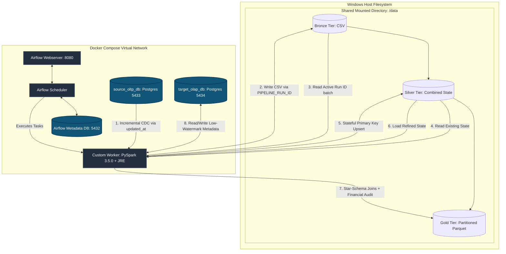

# Project Architecture

# 1. Project Overview

### 1.1 Introduction

The **`Ecommerce_data_pipeline`** is a production-grade, fully containerized data platform that implements a localized **Medallion Architecture** (Bronze $\rightarrow$ Silver $\rightarrow$ Gold). Orchestrated by **Apache Airflow**, the pipeline ingests transactional data from an operational source system, executes stateful data enrichment and incremental merging via **PySpark**, and exposes highly optimized analytical assets for downstream business intelligence consumption.

The entire framework is isolated within a dedicated virtual network using **Docker Compose**, eliminating local environmental dependencies and ensuring consistent, idempotent deployments across staging and production environments.

---

### 1.2 Project Objective

The primary engineering objective of this project is to shift from a legacy, destructive full-load framework to an efficient, low-overhead **Incremental Ingestion (Change Data Capture)** mechanism. The pipeline architecture is designed to:

* Automatically capture source mutations across e-commerce core tables (`source_customers`, `source_products`, and `source_orders`) utilizing high-watermark timestamp tracking.
* Isolate, audit, and deduplicate concurrent data batches without risking data loss or state contamination.
* Compute optimized analytical aggregations that power business dashboards while maximizing infrastructure resource utilization.

---

### 1.3 Business Context & Analytical Impact

Modern e-commerce platforms generate massive volumes of transactional logs daily. Traditional data systems frequently experience performance degradation because they run daily full-table overwrites, which heavily strain transactional databases and waste storage bandwidth.

By executing micro-batch incremental workloads, this project minimizes compute footprints on operational infrastructure. At the destination tier, it builds a star-schema analytical warehouse layer that surfaces vital corporate performance health metrics:

$$
\mathrm{Total\ Revenue} = \sum(\mathrm{total\_amount})
$$

$$
\mathrm{Total\ Orders} = \mathrm{Count}(\mathrm{order\_id})
$$

Downstream analytics users (such as BI Engineers and Product Managers) can evaluate these KPIs with near-zero query lag, eliminating the technical friction usually caused by parsing raw, un-indexed backend database records.

---

### 1.4 Expected Outcome & Target Stakeholders

The end state of the automated pipeline is a structured, optimized physical data lake layout.

* **Data Storage Assets:** Raw ingestion batches are cleanly isolated by execution tokens, transformed into structurally verified historical tables, and stored as highly compressed, Hive-partitioned Parquet files organized physically by `order_date=YYYY-MM-DD`.
* **Target Audience:** The direct beneficiaries include **Data Analysts** requiring low-latency access to pre-aggregated datasets, **Data Engineers** seeking a modular blueprint for stateful change capture, and **Business Leaders** tracking daily revenue and velocity fluctuations.

---

### 1.5 Core System Scope

The boundaries of the platform are explicitly defined to enforce architectural decoupling:

| Component | In-Scope Operational Boundary | Out-of-Scope System Boundary |
| --- | --- | --- |
| **Ingestion** | Micro-batch extraction from relational PostgreSQL OLTP engines using `updated_at` watermarks. | Real-time event streaming via tools like Apache Kafka or AWS Kinesis. |
| **Processing** | In-memory distributed data cleansing, schema validation, stateful deduplication, and aggregation via PySpark. | Complex, long-term machine learning model training or real-time predictive inferencing. |
| **Orchestration** | End-to-end task scheduling, pipeline run-id propagation, dependency enforcement, and failure retries through Airflow. | Advanced multi-tenant corporate security access routing or external identity management integration (OIDC/SAML). |
| **Serving Layer** | Local physical data lake files formatted with explicit partitioning structures ready for BI engine connectivity. | Direct generation, styling, or rendering of public-facing front-end data visualizations and reporting applications. |

---

